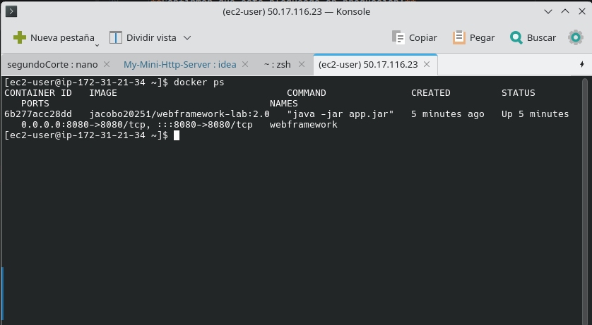
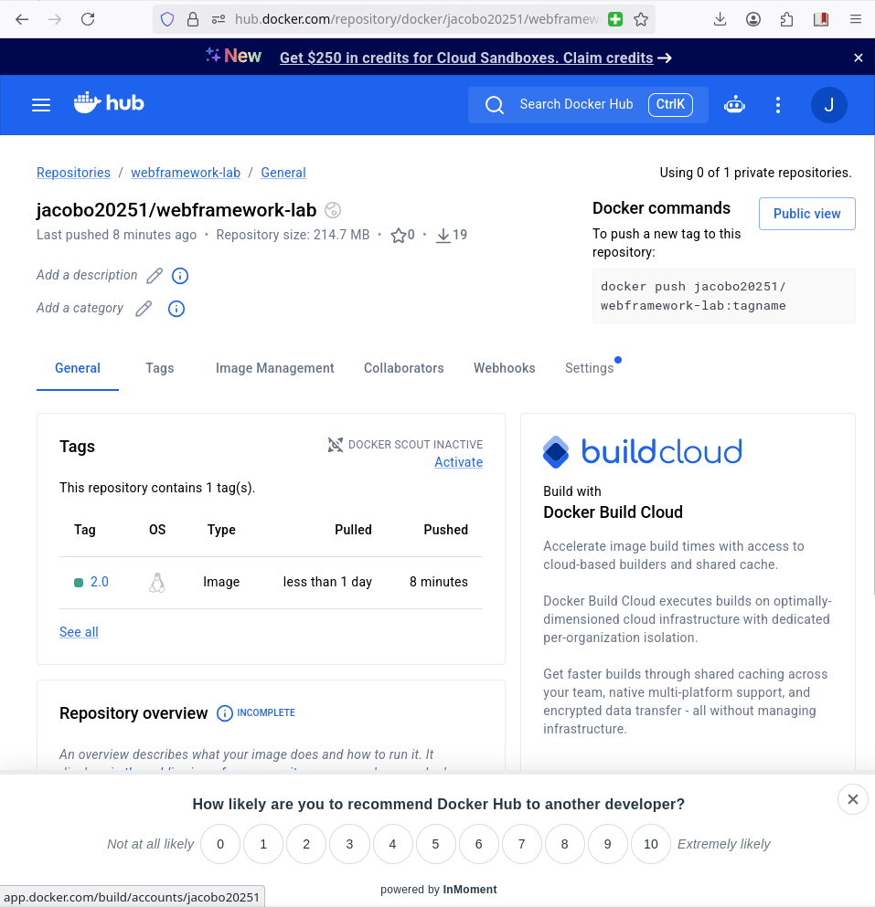
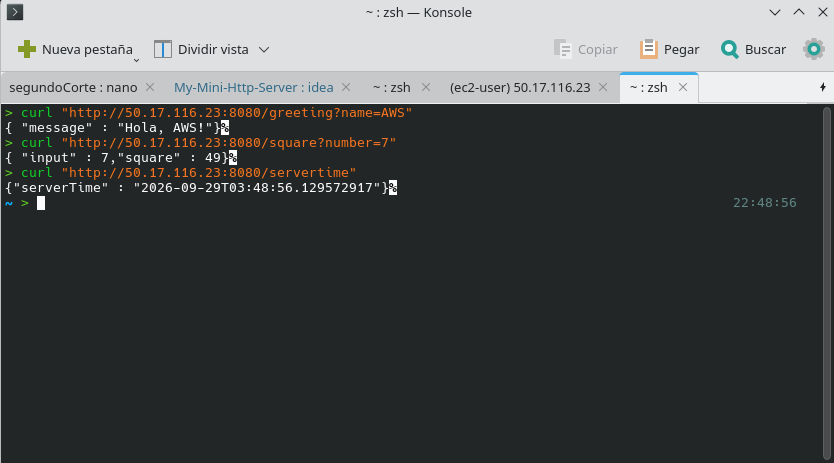
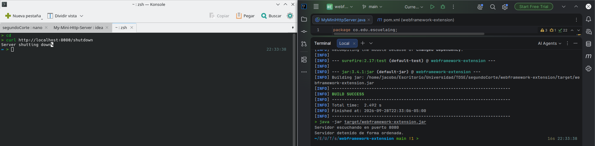
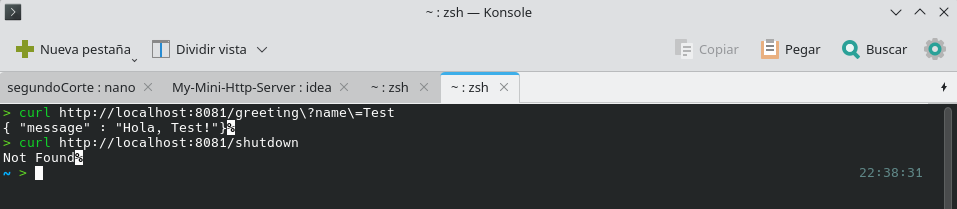

# Web Framework Extension — Concurrencia y Apagado Ordenado

Extensión de un servidor HTTP construido desde cero con `java.net.ServerSocket`. Se incorporan procesamiento concurrente, apagado ordenado, configuración mediante variables de entorno y despliegue con Docker en AWS EC2.

> **Importante:** Este proyecto no utiliza Spring.

---

## 1. Funcionalidades

El servidor base soporta:

* Archivos estáticos con protección contra Path Traversal.
* `/greeting`
* `/square`
* `/servertime`
* Manejo de errores `400`, `404` y `405`.

En esta extensión se agregaron:

| Funcionalidad        | Descripción                                                                              |
| -------------------- | ---------------------------------------------------------------------------------------- |
| **Concurrencia**     | `ExecutorService` con un pool fijo de 10 hilos para procesar conexiones simultáneamente. |
| **Apagado ordenado** | `/shutdown` cambia `running` a `false` y cierra el `ServerSocket`.                       |
| **Configuración**    | El puerto se obtiene de `PORT`, con `8080` como valor predeterminado.                    |
| **Entorno**          | `APP_ENV` controla la disponibilidad de `/shutdown`.                                     |
| **Docker**           | Aplicación empaquetada en una imagen Docker.                                             |
| **AWS EC2**          | Aplicación desplegada y accesible mediante IP pública.                                   |

---

## 2. Estructura del proyecto

```text
webframework-extension/
├── pom.xml
├── Dockerfile
├── webroot/
│   └── index.html
└── src/
    └── main/
        └── java/
            └── org/example/
                └── MyMiniHttpServer.java
```

---

## 3. Prerrequisitos

* Java 21 o superior
* Maven 3.9 o superior
* Docker Desktop

---

## 4. Ejecución local

```bash
git clone [URL DEL REPOSITORIO]
cd webframework-extension
mvn clean package
java -jar target/webframework-extension.jar
```

Configuración predeterminada:

```text
PORT=8080
APP_ENV=development
```

### Endpoints

```bash
curl "http://localhost:8080/greeting?name=Pedro"
curl "http://localhost:8080/square?number=5"
curl "http://localhost:8080/servertime"
```

---

## 5. Concurrencia

Las conexiones son delegadas a un pool de 10 hilos:

```java
ExecutorService pool = Executors.newFixedThreadPool(10);

pool.submit(() -> handleClient(client));
```

Esto permite procesar varias peticiones simultáneamente en lugar de atenderlas de forma secuencial.

---

## 6. Apagado ordenado

El endpoint:

```text
GET /shutdown
```

está disponible únicamente en `development`.

```bash
curl "http://localhost:8080/shutdown"
```

El servidor establece:

```java
running = false;
```

y cierra el `ServerSocket`, permitiendo liberar el `accept()` bloqueado y finalizar el proceso correctamente.

```text
Servidor detenido de forma ordenada.
```

En producción, Docker establece:

```dockerfile
ENV APP_ENV=production
```

por lo que `/shutdown` responde:

```text
404 Not Found
```

---

## 7. Docker

### Construir la imagen

```bash
docker build -t webframework-lab:2.0 .
```

### Ejecutar

```bash
docker run -d \
  --name webframework \
  -p 8080:8080 \
  webframework-lab:2.0
```

### Verificar

```bash
docker ps
```



### Docker Hub



```text
[usuario]/webframework-lab:2.0
```

---

## 8. Despliegue en AWS EC2

La aplicación fue desplegada en una instancia AWS EC2 mediante Docker.

**IP pública:**

```text
50.17.116.23
```

### Endpoints

```text
http://50.17.116.23:8080/greeting?name=AWS
http://50.17.116.23:8080/square?number=7
http://50.17.116.23:8080/servertime
```

### Comandos utilizados

```bash
sudo yum update -y
sudo yum install -y docker
sudo service docker start
sudo usermod -a -G docker ec2-user

docker pull [usuario]/webframework-lab:2.0

docker run -d \
  --name webframework \
  -p 8080:8080 \
  [usuario]/webframework-lab:2.0
```

### Evidencias




---

## 9. Pruebas realizadas

| Prueba                     | Resultado                         |
| -------------------------- | --------------------------------- |
| `/greeting`                | Respuesta de saludo               |
| `/square`                  | Cálculo del cuadrado              |
| `/servertime`              | Hora del servidor                 |
| Peticiones simultáneas     | Procesamiento concurrente         |
| `/shutdown` en development | Apagado ordenado                  |
| `/shutdown` en production  | `404 Not Found`                   |
| Docker                     | Contenedor ejecutándose           |
| AWS EC2                    | Endpoints accesibles públicamente |

---

## 10. Evidencias adicionales

### Apagado ordenado



### Docker



---

## 11. Video de demostración

El video muestra la ejecución local, las pruebas de concurrencia, el apagado ordenado, la ejecución mediante Docker y el despliegue en AWS EC2.

**Video:**

https://drive.google.com/file/d/1upt-t6AujBBn61gbhu6PyHtSf1EBfs6B/view?usp=sharing

---

## 12. Limitaciones

* El pool utiliza un tamaño fijo de 10 hilos.
* `/shutdown` se restringe mediante `APP_ENV`, sin autenticación.
* No se implementa HTTPS.
* No existe persistencia de estado.

---

## Tecnologías

| Tecnología        | Uso                           |
| ----------------- | ----------------------------- |
| Java 21           | Servidor HTTP                 |
| `ServerSocket`    | Comunicación mediante sockets |
| `ExecutorService` | Concurrencia                  |
| Maven             | Compilación                   |
| Docker            | Contenerización               |
| AWS EC2           | Despliegue                    |

---

## Autor

**Jacobo Diaz Alvarado**
